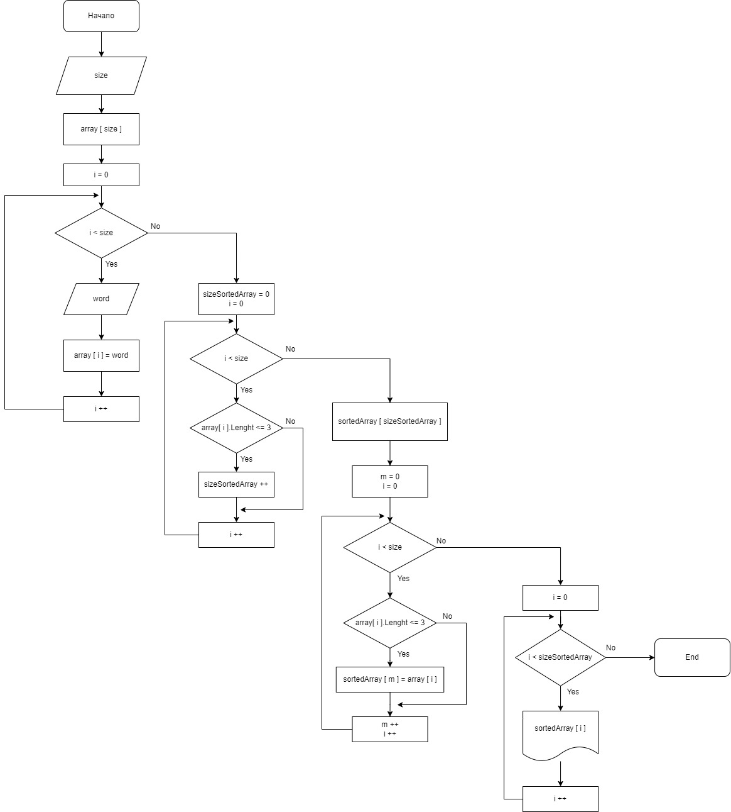

# Блок схема

# Текстовое описание решения

        Работа программы начинается с запроса количества вводимых слов, далее объявляется массив и 

        заполняется пользователем с клавиатуры. Следующим шагом, определяется размер нового отсортированного 
        
        массива, посредством определения в исходном массиве элементов содержащих 3 и менее символов. 
        
        После объявляется массив с найденным размером и заполняется алгоритмом описанным выше. 
        
        В конце выводится полученный массив, когда массив выведен программа заканчивает свою работу.